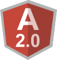

# grids
A grid comparison standard

Our goal is to make the market research easier, for people to be able to find a grid for their needs, in their price range.
We do not include every small feature, but only major features that have real use cases behind them.

---

## Contribution
If you want to add a grid, please create a pull request of a new file in `grids`. We have automated testing for you to know if everything was done correctly.
If you want to change information for a grid, you must also reference a legitimate source for it.
If we are missing a grid feature, please create an issue, and we will consider adding it.

---

## Shallow Comparison
Here we compare the grids using the markdown table, to show no bias to any grid. If willing, other grids can show this table using their grid.
This comparison is alphabetical, to avoid owner's bias.

**Legend**:
-  Has.
-  Does not have.
-  N/A.

|**/**|ag-Grid-Enterprise|ag-Grid|Handsontable|
|-----|------------------|-------|------------|
|**Logo**||||
|**Frameworks**|, , , , , |, , , , , |, |
|**Description**||Advanced Data Grid / Data Table supporting Javascript / React / AngularJS / Web Components|Handsontable Community Edition - a JavaScript/HTML5 Spreadsheet Library for Developers|
|**License**|[License](https://github.com/ceolter/ag-grid-enterprise/blob/master/LICENSE.md)|MIT|MIT|
|**Price**|£495+|Free|Free|
|**Repository**|[Repository](https://github.com/ceolter/ag-grid-enterprise)|[Repository](https://github.com/ceolter/ag-grid)|[Repository](https://github.com/handsontable/handsontable)|
|**Stars**|50 :star:|2300 :star:|7500 :star:|
|**Website**|[Website](https://www.ag-grid.com/)|[Website](https://www.ag-grid.com/)|[Website](https://handsontable.com/)|
|**Demo**|[Demo](https://www.ag-grid.com/example.php)|[Demo](https://www.ag-grid.com/example.php)|[Demo](https://handsontable.com/examples.html)|
|**-**||||
|**General**||||
|**Pivot Mode**||||
|**Print Mode**||||
|**Export**|CSV, XLSX|CSV, XLSX|CSV|
|**Pagination**||||
|**Virtual Pagination**||||
|**-**||||
|**Rows**||||
|**Rows Grouping**||||
|**Floating Rows**||||
|**Full Width Rows**||||
|**Rows Numbering**||||
|**Rows Selection**||||
|**Virtual DOM**||||
|**Dynamic Add Rows**||||
|**Dynamic Remove Rows**||||
|**Dynamic Row Height**||||
|**-**||||
|**Columns**||||
|**Filtering**||||
|**Filters**|Text, Number, Date, Select, Custom|Text, Number, Date, Select, Custom|Text, Number, Select|
|**Sorting**||||
|**Pinning**||||
|**Reordering**||||
|**Resizing**||||
|**Header Grouping**||||
|**Selection**||||
|**Validation**||||
|**Control Menu**||||
|**Aggregation**|Sum, Average, Min, Max, First, Last|Sum, Average, Min, Max, First, Last||
|**Header Rendering**||||
|**-**||||
|**Cells**||||
|**Custom Rendering**||||
|**Formula Support**||||
|**Inline Editing**||||
|**Custom styling**||||
|**Clipboard**||||
|**Keyboard Navigation**|Arrows, Enter, Tab|Arrows, Enter, Tab|Arrows, Enter, Tab, Page, Home, End, UNDO/REDO|
|**Range Selection**||||
|**Merge Cells**||||
|**-**||||
|**Nice To Have**||||
|**Animations**||||
|**Custom Icons**||||
|**Custom Overlays**||||
|**Global Search**||||
|**Internationalisation**||||
|**Master/Slave**||||
|**RTL Support**||||
|**Footer**||||
|**Touch support**||||